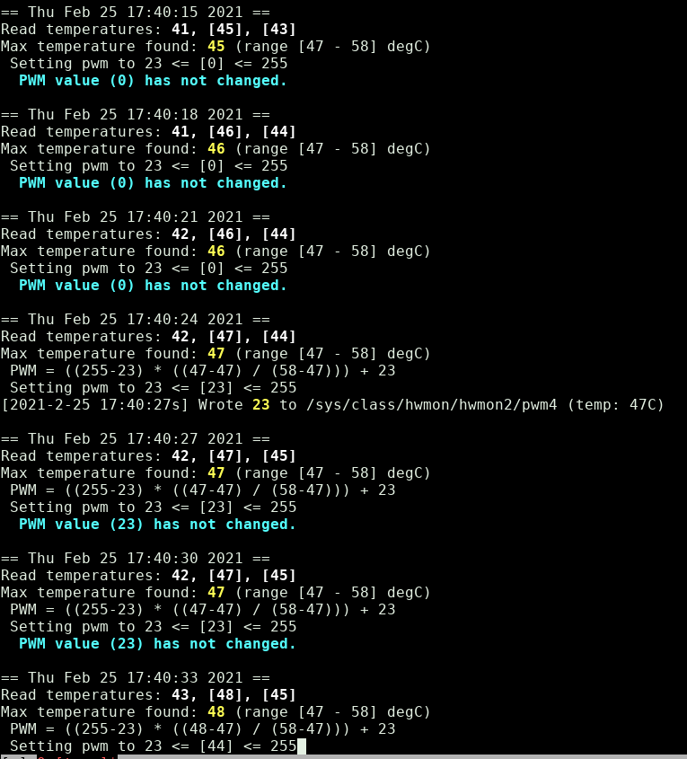
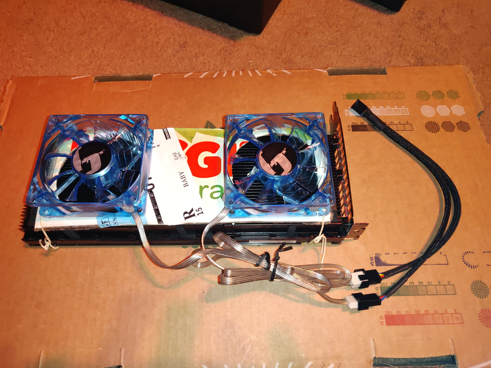

# Monitor of Nvidia GPU temperatures for Fan PWM Control

by jaggz.h who is still using gmail.com  
2021-02-10

# Danger:

This software modifies one or more system fans.  Its intent is to try to mis-use
a specialty GPU card in a normal PC not designed for it, but this is inherently
a known problem; doing this, including modifying system fans, or otherwise
using this software, can result in damage to your hardware, your fingers, pets,
family members, etc.  You may even burn your house down as a result.  Please do
not use this unless you know what you're doing, release the author(s) and
contributor(s) from all liability, and read and accept the license and
disclaimers.




## Bonuses:
1. It's written in perl!
1. Yes that is a Huggies babywipes box.
1. This is the first version of this script.
1. It checks for existing running versions of itself (pgrep) and won't run again. There's no way to force it currently.
1. It uses nvidia-smi's output loop to monitor, and tests if it fails and will restart nvidia-smi if it has to.  It must be in the path.  Writing to the PWM speed control files requires root.
1. Look at the top of the file for configuration variables.
1. But first, some help with K80's in a PC is likely needed...
1. For the Nvidia K80's, make sure to enable above 4GB memory access somewhere in your BIOS (it can be tough to find!)
1. For the Nvidia K80's in a normal desktop, you might need to add something like "pci=nocrs,noearly" to your kernel options (it worked for me).  Without this, I still got errors mapping the BOM (whatever that is).  Credit to "nvidiavl67d" here (https://forums.developer.nvidia.com/t/cannot-install-driver-for-nvidia-tesla-k40-cards-on-fedora-20/35690/11).  You might also want to see that page to see the ways of detecting if your memory is not being mapped correctly in the first place (like "dmesg | grep NVRM", and checking your 'Regions:' found in "lspci -vvv").
1. You'll have to figure out how to power the GPU. Thankfully, my PSU has an additional "8-Pin CPU" connector (aka "EPS-12v") hanging out of it (labeled CPU-2); that goes right into the K80.  That worked for me and I didn't need any additional dongles or adaptors from PCI-E or anything.
1. The fans... The fans.  I bought a 4-pin fan splitter. It powers both fans, and lets both be driven with PWM.  One of the connectors (and its wire) does not have the sensor pin -- they do this so the motherboard senses one fan's speed, but can PWM both of them.  (It can't sense both of them through a shared single connection.)
1. This script does not yet actually read the speed, it blindly sets the PWM value.
1. I'm not that familiar with reasonable temperatures.  You'll see what I set for min and max values for temperature and PWM'ing.  I set the minimum to what my system had when everything was cool, and the max pwm to 255 ("obviously"), and max temperature to 45.  If you go lower, your speed steps will end up being jumpier (due to the smaller number of integers between max and min).  If you go higher, the max speed won't be reached as soon.  I did not do a curve -- it's just linear.

1. This script must be able to write to your pwm control files, so you'll need to give your user access to those, or run this as root (I'm running it with sudo). If it doesn't have access you'll get errors like this:


1. The files are hard-coded. I don't know a way to intelligently find this out, but my fans are hooked up to a splitter that runs to a motherboard chassis fan connector:
```
my $pwm_fn        = "/sys/class/hwmon/hwmon2/pwm4";
my $pwm_enable_fn = "/sys/class/hwmon/hwmon2/pwm4_enable";
```

1. The GPU ID's are hard-coded as well. My video card is id 0. The K80 comes in at 1 and 2.  So I set these at the top of the file as well:
```
my $expected_gpu_count=3;
my @gpuids=(1,2);  # ids of interest from nvidia (to check their temperatures)
```

